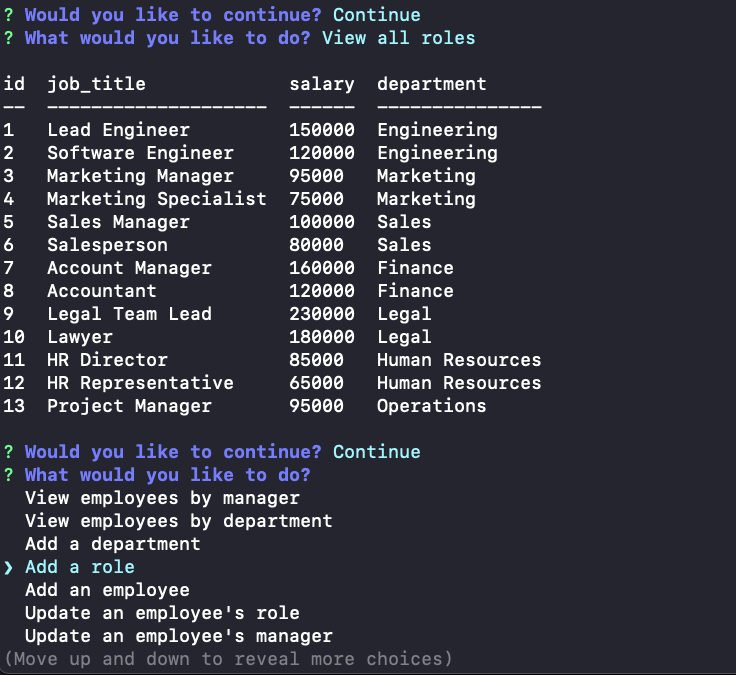

# Employee Tracker

## Description
Command line CMS application for managing a company's employee database.

## Installation & Usage
1. Download to local machine
2. Install dependencies with "npm install"
3. Create database by starting MySQL server and running "source db/db.sql" in MySQL shell
4. Setup database by running "source db/schema.sql" in MySQL shell
5. Seed database by running "source db/seeds.sql" in MySQL shell
6. To run application, start server by running "npm start"

## Screenshot

## Video Walkthrough
[Click here to watch the video walkthrough!](https://watch.screencastify.com/v/a7rdspK2cCNJyPYwdyi3)

# Questions
For questions contact Sophia Barrett at [sophia@yoursummit.media](mailto:sophia@yoursummit.media) or visit [github.com/sophiabarrett](https://github.com/sophiabarrett).

## License

Copyright © 2021 Sophia Barrett

Permission is hereby granted, free of charge, to any person obtaining a copy of this software and associated documentation files (the "Software"), to deal in the Software without restriction, including without limitation the rights to use, copy modify, merge, publish, distribute, sublicense, and/or sell copies of the Software, and to permit persons to whom the Software is furnished to do so, subject to the following conditions:

The above copyright notice and this permission notice shall be included in all copies or substantial portions of the Software.

THE SOFTWARE IS PROVIDED "AS IS", WITHOUT WARRANTY OF ANY KIND EXPRESS OR IMPLIED, INCLUDING BUT NOT LIMITED TO THE WARRANTIES OF MERCHANTABILITY, FITNESS FOR A PARTICULAR PURPOSE AND NONINFRINGEMENT. IN NO EVENT SHALL THE AUTHORS OR COPYRIGHT HOLDERS BE LIABLE FOR ANY CLAIM, DAMAGES OR OTHER LIABILITY, WHETHER IN AN ACTION OF CONTRACT, TORT OR OTHERWISE, ARISING FROM, OUT OF OR IN CONNECTION WITH THE SOFTWARE OR THE USE OR OTHER DEALINGS IN THE SOFTWARE.